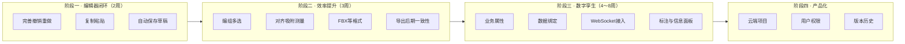

# 数字孪生平台 · 未实现功能规划

> 文档版本：2026-07-02  
> 基于当前代码库（React + Three.js + Zustand）梳理的**待实现功能清单**，按优先级与模块分类，供后续迭代参考。

---

## 一、当前已完成能力（基线）

避免重复开发，以下能力**已实现**，不在本清单内：

| 模块 | 能力 |
|------|------|
| 场景编辑 | 场景树、单选、删除、变换 Gizmo、几何体组件库 |
| 资产 | 本地 GLB/GLTF 导入、Poly Haven 模型/贴图/HDR |
| 材质 | 17 种材质、UV 编辑、贴图动画 |
| 灯光 | 5 类灯光、Helper 可视化、属性面板 |
| 环境 | 背景色、HDR 背景/环境、雾效、相机/渲染器设置 |
| 后期 | 编辑器内多种后期效果（Bloom、SSAO 等） |
| 漫游 | 站点漫游 / 一镜到底、路线编辑与导出 |
| 导出 | GLB、截图、scene.json、静态展示项目包 ZIP |
| 项目 | **保存项目 / 打开项目**（含导出包回导继续编辑） |
| 其他 | 基础撤销重做（仅变换）、快捷键、FPS/面数统计 |

---

## 二、优先级说明

| 等级 | 含义 | 建议节奏 |
|------|------|----------|
| **P0** | 编辑器核心闭环，直接影响日常使用 | 1～2 周可落地 |
| **P1** | 明显提升效率或交付质量 | 2～4 周 |
| **P2** | 数字孪生差异化能力 | 1～2 月 |
| **P3** | 产品化 / 架构 / 长期建设 | 按需规划 |

---

## 三、编辑器体验（P0～P1）

### 3.1 撤销 / 重做完善 【P0】

**现状**：`historyStore` 仅记录移动 / 旋转 / 缩放，材质修改、增删对象、灯光变更未纳入。

**建议实现**：
- 扩展 `HistoryEntry` 类型，覆盖：`add`、`remove`、`material`、`light`、`globalSettings`
- 统一 `push` 入口，各面板操作后写入历史
- 工具栏或状态栏显示是否可撤销 / 重做

**价值**：降低误操作成本，接近成熟 DCC 工具的基础体验。

---

### 3.2 复制 / 粘贴 / 克隆 【P0】

**现状**：无 Ctrl+C / Ctrl+V / 右键克隆；重复摆放模型需重新导入。

**建议实现**：
- 深拷贝选中 `Object3D`（含材质与 `userData.id` 重新生成）
- 粘贴时偏移一定距离，避免完全重叠
- 同步更新 `sceneStore.objects`

---

### 3.3 编组 / 解组 【P1】

**现状**：`SceneObject` 类型含 `group`，但场景树无编组操作；多对象只能平铺在根级。

**建议实现**：
- 多选后「编组」→ 创建 `THREE.Group` 包裹选中项
- 「解组」→ 保留子节点世界变换，拆到父级
- 场景树展示组层级，支持折叠

---

### 3.4 多选与批量操作 【P1】

**现状**：`selectObject(id, multi)` 已支持多选参数，但场景树 / 视口未提供 Shift 多选、框选。

**建议实现**：
- Shift + 点击追加选择
- 框选（视口矩形拾取）
- 批量移动 / 删除 / 隐藏 / 导出

---

### 3.5 自动保存与未保存提示 【P0】

**现状**：仅「打开项目」时有覆盖确认；刷新页面、关闭标签页会丢数据（除非手动保存）。

**建议实现**：
- `localStorage` / `IndexedDB` 定时草稿（如每 30s）
- 启动时检测草稿，提示恢复
- `beforeunload` 未保存离开提醒
- 工具栏显示「已保存 / 未保存」状态

---

### 3.6 对齐、吸附、测量 【P1】

**现状**：变换完全自由，无网格吸附、无尺寸标注。

**建议实现**：
- 移动时吸附网格（步长可配置）
- 两对象 / 两点测距（`THREE.Line` + CSS2D 标签显示距离）
- 可选：角度吸附（15° / 45° / 90°）

---

### 3.7 更多模型格式 【P1】

**现状**：仅支持 GLB/GLTF（`useModelLoader`）。

**建议实现**：
- FBX（`FBXLoader`）
- OBJ + MTL
- STL（工业零件常见）
- 可选：IFC / STEP（需额外解析库，工作量大）

---

### 3.8 场景树增强 【P1】

**现状**：基础树形展示、搜索、删除；无拖拽排序、无重命名内联编辑。

**建议实现**：
- 双击重命名
- 拖拽调整父子关系（reparent，保持世界矩阵）
- 锁定 / 单独隐藏（不影响子级策略可配置）
- 对象数量统计去重（灯光勿重复计）

---

## 四、渲染与导出（P1）

### 4.1 导出运行时后期一致性 【P1】

**现状**：编辑器内 `EffectComposer` 完整；导出项目包 `main.js` **未内置完整后期管线**（模板 README 已说明）。

**建议实现**：
- 将 `postProcess` 配置注入导出 `main.js`
- 或提供「仅编辑器预览 / 导出含后期」开关
- 保证预览与交付效果一致

---

### 4.2 模型优化工具 【P1】

**现状**：状态栏有三角面 / 顶点统计，无优化能力。

**建议实现**：
- 单模型 / 全场景面数报告与告警阈值
- 集成 `gltf-transform` 或 Blender CLI：减面、Draco 压缩、贴图尺寸压缩
- 导出前一键优化选项

---

### 4.3 LOD / 实例化 【P2】

**现状**：大场景所有 mesh 全精度渲染。

**建议实现**：
- 重复模型 `InstancedMesh` 合并
- 按距离切换 LOD（需预处理多级 GLB 或自动生成）

---

### 4.4 截图 / 视频导出 【P2】

**现状**：仅单帧 PNG 截图。

**建议实现**：
- 自定义分辨率截图
- 按相机漫游路线录制 MP4 / 帧序列
- 透明背景导出

---

## 五、数字孪生核心（P2）

> 当前定位是「3D 场景编辑器」，以下是从**数字孪生平台**视角最缺的能力。

### 5.1 业务对象与自定义属性 【P2】

**现状**：对象仅有 `id / name / transform / visible`，无业务语义。

**建议实现**：
- 为每个对象扩展 `userData` 或 store 字段：`deviceId`、`tags`、`customProps`
- 属性面板增加「业务」Tab：设备编号、类型、数据源地址
- 导出 `scene.json` 时一并序列化

---

### 5.2 数据绑定引擎 【P2】

**现状**：场景静态，无法接入实时数据。

**建议实现**：
- 配置式映射：`{ objectId, dataKey, mapping: 'color' | 'visible' | 'rotationY' | ... }`
- 支持 Mock 数据 / REST 轮询 / WebSocket
- 运行时（导出包 `main.js`）与编辑器预览共用同一套绑定逻辑

---

### 5.3 实时数据接入 【P2】

**建议实现**：
- WebSocket 客户端（通用 JSON 协议）
- MQTT over WebSocket（工业常见）
- 连接状态、断线重连、数据节流

---

### 5.4 场景标注与信息面板 【P2】

**现状**：相机漫游点有 Sprite 标签，无业务 HUD。

**建议实现**：
- `CSS2DRenderer` 名称标签（始终面向相机）
- 点击设备弹出数据卡片（当前值、状态、迷你趋势）
- 状态色：正常 / 告警 / 离线

---

### 5.5 告警与联动规则 【P3】

**建议实现**：
- 阈值规则：温度 > 80 → 模型变红 + 面板告警
- 简单脚本 / 表达式：`if (data.pressure > max) showAlert()`
- 多对象联动：点击阀门高亮关联管道

---

### 5.6 历史数据回放 【P3】

**建议实现**：
- 时间轴控件
- 按时间戳回放设备状态驱动场景变化
- 与数据绑定引擎共用映射配置

---

### 5.7 大屏数据可视化 【P3】

**建议实现**：
- 叠加大屏布局（左侧 KPI、右侧 3D、底部图表）
- 集成 ECharts 绑定同一份数据源
- 布局可配置并随项目包导出

---

## 六、协作与产品化（P3）

### 6.1 用户与权限

- 登录 / 注册（或对接企业 SSO）
- 项目归属、分享链接、只读 / 可编辑权限

### 6.2 云端项目存储

- 项目列表、搜索、标签
- 云端保存替代纯本地下载 ZIP
- 与自动保存草稿互补

### 6.3 版本历史

- 每次保存生成版本快照
- 对比 / 回滚到历史版本

### 6.4 多人协作

- 实时协同编辑（OT/CRDT，复杂度高）
- 或轻量「锁定编辑权」+ 评论标注

---

## 七、架构与工程质量（P1～P3）

### 7.1 去除全局 `window` 依赖 【P1】

**现状**：`__editorScene`、`__editorCamera`、`__globalSettingsState` 等挂载在 `window`，不利于测试与 SSR。

**建议**：
- 引入 `EditorContext` 或专用 `editorBridge` 单例
- 面板 / hooks 通过 context 访问场景与渲染器

---

### 7.2 单元测试与 E2E 【P2】

**现状**：无测试文件。

**建议**：
- 工具函数：`sceneConfigExporter`、`editorProjectImporter`、`textureUvUtils`
- 关键流程 E2E：导入模型 → 改材质 → 保存 → 打开 → 断言对象数与位置

---

### 7.3 性能监控 【P2】

- 实时渲染耗时、draw call 统计
- 超阈值时提示优化建议

---

### 7.4 插件 / 扩展机制 【P3】

- 预留「自定义面板」「自定义导出格式」注册 API
- 方便行业客户二次开发

---

## 八、体验与细节（P1～P2）

| 功能 | 说明 |
|------|------|
| 视口拖放导入 | 将 GLB / 项目 ZIP 拖入视口直接导入 |
| 快捷键补全 | 文档与实现统一；Focus 选中对象（F）、全选（Ctrl+A） |
| 线框 / 透视模式 | `editorStore.wireframeMode` 已有字段，可完善切换 |
| 材质预设库 | 保存 / 复用常用材质配置 |
| 场景模板 | 空场景、展厅、工厂车间等一键初始化 |
| 国际化 i18n | UI 文案中英文切换 |
| 暗色主题完善 | 部分 Ant Design 组件与自定义样式统一 |
| 移动端适配 | 触摸旋转 / 缩放（低优先级） |

---

## 九、已评估暂缓项

| 功能 | 原因 |
|------|------|
| **AI 文生/图生 3D** | 需后端 + 第三方 API / GPU，成本高；当前手动导入 + Poly Haven 可满足大部分搭建需求 |
| **CAD 精确建模** | 超出 Web 编辑器范畴，建议对接外部 CAD 流程 |
| **物理仿真** | 需 Cannon.js / Ammo.js 等，与数字孪生展示场景重合度有限 |

---

## 十、推荐实施路线图

---

## 十一、与代码位置的对应关系

便于开发时快速定位：

| 待扩展点 | 相关文件 |
|----------|----------|
| 历史记录 | `src/store/historyStore.ts`、`EditorViewport.tsx` |
| 场景对象 | `src/store/sceneStore.ts`、`SceneTree.tsx` |
| 项目存取 | `src/utils/editorProjectExporter.ts`、`editorProjectImporter.ts` |
| 导出运行时 | `src/utils/exportedProjectTemplates.ts`、`projectPackageExporter.ts` |
| 全局状态 | `GlobalSettings.tsx`、`window.__globalSettingsState` |
| 数据绑定（新建） | 建议 `src/engine/dataBinding/` |
| 标注（新建） | 建议 `src/components/Overlays/` + `CSS2DRenderer` |

---

## 十二、总结

当前项目作为 **3D 场景编辑器** 已具备较完整的搭建 → 保存 → 导出链路；距离 **数字孪生平台** 的主要差距在：

1. **编辑效率**（撤销、复制、编组、自动保存）
2. **数据驱动**（实时接入、绑定、标注、告警）
3. **工程化**（测试、去全局变量、云端协作）

建议优先完成 **P0 编辑器闭环**，再切入 **P2 数据绑定 + 标注**，这样能以最小成本让平台从「展示工具」升级为「可运行的孪生体」。

---

*本文档随项目演进更新，新功能落地后请从清单中移除或移至「已完成」章节。*
